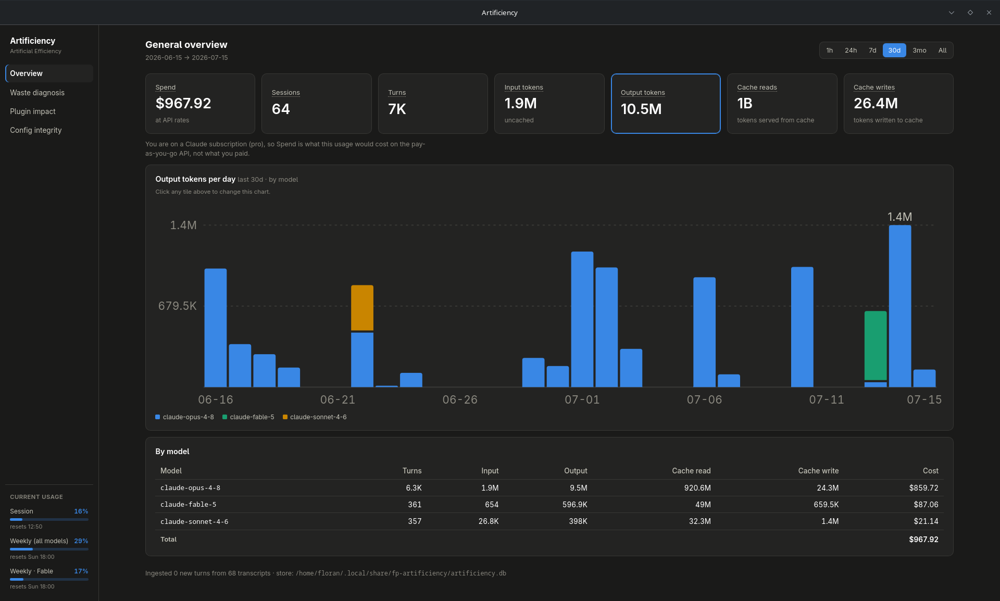
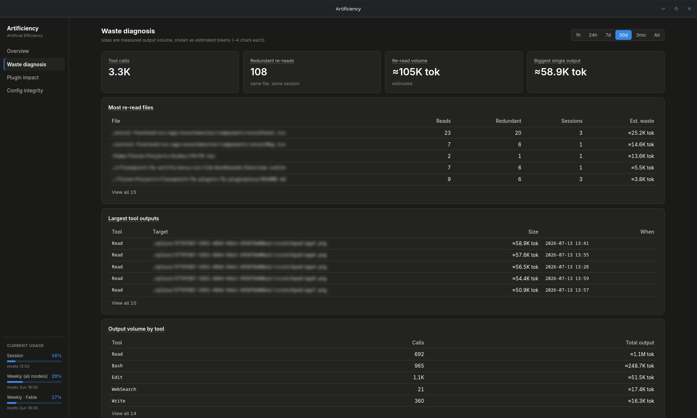

# Artificiency

**Flarepoint | Artificial Efficiency.** Local-first analytics for your AI coding usage.


-informational)
-8A63D2)


<!-- Add once the repo path is public:

-->

Every usage tracker tells you *how much* you spent. Artificiency tells you **why**. It shows
where the tokens actually went (re-read files, oversized tool dumps, cache churn, subagent
overhead), and whether the change you made (a new plugin, an edited `CLAUDE.md`, a different
workflow) actually helped. It runs entirely on your machine, and your transcripts never
leave it.

> ⚠️ **Early development.** Artificiency is pre-1.0 and under active design and
> construction. Interfaces, the data schema, and the UI change frequently, and there are
> no released builds yet. The way to run it today is to build from source (below).

---

## Screenshots

| Overview | Waste diagnosis |
|---|---|
|  |  |

> The dashboard is under active visual development, so these will change. See
> [docs/screenshots](./docs/screenshots) for how to refresh them.

---

## What it does today

- **Overview:** spend, tokens, turns, sessions and cache activity over any range (1h → all
  time), a per-model breakdown with estimated cost, and a trend chart you can flip between
  metrics (spend, output, turns, cache, and so on).
- **Waste diagnosis:** redundant file re-reads, largest single tool outputs, and output
  volume per tool, each with an estimate of the tokens involved and tips on avoiding it.
- **Current usage:** your subscription limit meters (session and weekly), read from
  the same source the official view uses.
- **Cost engine:** per-model pricing (input, output, and cache read/write) computed
  locally.

## Status & roadmap

Artificiency is being built on **Linux**, which is the daily development target for now.
The stack (Tauri v2 with a Rust core) is cross-platform by design, and the goal is full
support for **all three desktop platforms** and **many AI providers**.

| Area | Today | Planned |
|---|---|---|
| Platform | Linux | **macOS** and **Windows** as first-class targets. |
| Provider | Claude | Codex, Gemini, OpenRouter and others. Provider is a dimension, not a fork, so multiple sources combine into one dashboard |
| Distribution | Build from source | Signed, downloadable builds per platform |

macOS and Windows are not officially supported yet, but the code is written to run there,
and if you would like to try it early you can build it yourself with the steps below.

---

## Build from source

You will need, on every platform:

- **[Rust](https://rustup.rs/)** (stable, via `rustup`)
- **[Node.js](https://nodejs.org/)** 18+ (CI uses 22)

Plus the platform-specific system dependencies for a [Tauri v2](https://v2.tauri.app/start/prerequisites/)
app:

<details>
<summary><strong>Linux</strong></summary>

The WebKit webview and supporting libraries.

```sh
# Arch / CachyOS
sudo pacman -S --needed webkit2gtk-4.1 base-devel curl wget file openssl \
  librsvg libayatana-appindicator gtk3

# Debian / Ubuntu
sudo apt install libwebkit2gtk-4.1-dev build-essential curl wget file \
  libxdo-dev libssl-dev libayatana-appindicator3-dev librsvg2-dev
```

On GNOME, the tray icon needs a shell extension. The app is dashboard-first and does not
depend on the tray.
</details>

<details>
<summary><strong>macOS</strong></summary>

```sh
xcode-select --install   # Command Line Tools (provides the required toolchain)
```

The WebView is provided by the system (WKWebView), so there is nothing else to install.
</details>

<details>
<summary><strong>Windows</strong></summary>

- **Microsoft C++ Build Tools** (the "Desktop development with C++" workload).
- **WebView2 runtime.** Preinstalled on Windows 11 and current Windows 10. Otherwise,
  install the Evergreen runtime from Microsoft.
</details>

Then:

```sh
npm install

# Run the desktop app in development (hot-reloads the UI)
npm run tauri dev

# Produce a release build + installer for your platform
#   output lands under src-tauri/target/release/bundle/
npm run tauri build
```

First run backfills your existing Claude Code transcript history from
`~/.claude/projects`, so the dashboard is populated immediately.

---

## Project layout

- **`crates/artificiency-core`** is the Rust core: the SQLite store, collectors, and the
  cost/stats engine. It has no GUI dependencies, and compiles and tests standalone.
- **`src-tauri`** is the Tauri v2 desktop shell exposing core commands to the UI.
- **`src`** is the Svelte 5 dashboard.

## Development

```sh
cargo test -p artificiency-core            # core unit tests
npm run check                              # type-check the frontend
cargo run --example backfill /tmp/smoke.db # headless collector smoke run
cargo run --example limits                 # print what the usage widget would show
```

CI runs the core test suite on Linux, macOS, and Windows, and type-checks and builds the
frontend on Linux.

---

## Contributing

Thanks for the interest. Artificiency is still in its **design and early-construction
phase**, and the architecture, schema, and UI are moving too quickly for outside
contributions to be practical right now, so pull requests are not being accepted yet. That
will change as the project stabilises. In the meantime, issues and ideas are welcome.

## License

[MIT](./LICENSE) © 2026 Floran Prins

---

*Artificiency is a Flarepoint project. Local-first, and staying that way. Your data never
leaves your machine.*
